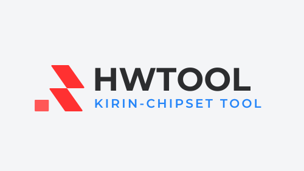

*Stand with Ukraine now.*
**#SupportUkraine**

https://protectukrainenow.org/

# HWTool (Huawei Kirin Tool)

*"The Sweden Swift Knife for Vanilla Kirin Bootloader Unlocking."*

💻 **HWTool** is the ultimate assistant for unlocking Huawei bootloaders. It supports a wide range of Kirin chipset devices and offers customization features such as flashing TWRP, installing custom ROMs, and more.

---

> [!WARNING]
> **THIS IS A BETA BRANCH, IF YOU WANT TO TRY NEW THING, DOWNLOAD THE SOURCE**

## 📃 TO-DO List
- [ ] make updater (69420 days left)
    - in this time you need to check updates manually (i dont want to make a updater)
- [ ] reach 100 star
- [x] fix bugs
- [x] done (basic) README
- [x] done (advanced) README
- [x] add LICENSE
- [x] complete wiki and the issue template 
- [x] add tags to README
- [x] developing
- [x] sleep
- [x] release stable version
- [ ] gui
      - python is GUI
      - batchfiles is CLI
- [x] cli

icl ts pmo sm n sb rn ngl, ru srsly srs n fr rn vro? lol atp js go b fr vro, idek nm, brb gng gtg atm Imao, bt ts pyo 2 js Imk lol onb fr nty b fr rn lk 💔💔💔

---
## 📜 Table of Contents

  
Expand

- [Disclaimer](#%EF%B8%8F-disclaimer)
- [What is HWTool?](#-what-is-hwtool)
- [How HWTool Works](#-how-hwtool-works)
- [Features](#-features)
- [Getting Started](#-getting-started)
- [Step-by-Step Guide](#-step-by-step-guide)
  - [Disassembling Your Device](#-disassembling-your-device)
  - [Entering Download Mode](#-entering-download-mode)
  - [Unlocking the Bootloader](#-unlocking-the-bootloader)
- [Supported Devices](#-supported-devices)
- [Troubleshooting](#-troubleshooting)
- [Credits](#-credits)
- [License](#-license)

---

## ⚠️ Disclaimer

By using HWTool, you agree to the following terms:

> [!CAUTION]  
> - Unlocking your bootloader **voids your warranty**.  
> - I am **not responsible for any damages**, including but not limited to:  
>   - Bricked devices  
>   - Dead SD cards  
>   - Other issues or malfunctions  
> - **Do your research** before proceeding. Ensure you understand the risks associated with using this tool and any ROMs or recoveries.  
> - YOU are solely responsible for any modifications made to your device. **Proceed at your own risk.**

---

## 🔧 What is HWTool?

HWTool simplifies the process of unlocking bootloaders, flashing recoveries, installing custom ROMs, and managing device recovery for Huawei smartphones and tablets with Kirin chipsets. It automates many steps, making it easier for users to customize their devices safely and effectively.

---

## ❓ How HWTool Works

HWTool automates the unlocking process using **ADB** and **Fastboot** tools. Here's how it works:

1. **Setup:**
   - Guides you on installing additional drivers such as **Huawei Testpoint Drivers**.

2. **Disassembly Guidance:**
   - Provides detailed instructions for safely disassembling your device to access the testpoint, with recommended tools like a plastic card and tweezers.

3. **Flash Process:**
   - Uses Fastboot and ADB to flash custom ROMs and recovery tools like **TWRP**.

4. **Bootloader Unlocking:**
   - Automatically flashes the bootloader into RAM and includes optional steps such as disabling FBLOCK security checks for advanced unlocking.

5. **Recovery and ROM Installation:**
   - Guides you through flashing TWRP recovery and installing your selected ROM while ensuring compatibility.

For more details, refer to the [PotatoNV GitHub repository](https://github.com/mashed-potatoes/PotatoNV?tab=readme-ov-file#how-it-works).

---

## 📋 Features

- Unlock bootloaders for supported Huawei Kirin devices.
- Flash custom recovery tools like **TWRP**.
- Install custom ROMs on compatible devices.
- Step-by-step guidance for disassembly and flashing processes.

---

## 🚀 Getting Started

### 📂 Requirements:

1. **ADB** tools installed and configured on your computer.  
2. Download and install **PotatoNV** (not included in HWTool - extract to "bin" folder).  
   - Refer to the [PotatoNV GitHub repository](https://github.com/mashed-potatoes/PotatoNV).  
3. Obtain compatible files:
   - Android versions **8** or **9**.
   - **TWRP** recovery.  
   - A custom **ROM** suitable for your device.  
4. Backup all important data to avoid any loss during the process.

### 🛠 Steps:

1. Verify your device is listed in the [Supported Devices List](https://github.com/NammIsADev/hwtool/blob/main/SUPPORT-DEVICES.md).
2. Install PotatoNV and follow HWTool instructions to unlock your bootloader.  
   ⚠ This process can potentially brick your device if not followed carefully.

---

## 🛠 Step-by-Step Guide

### 🔩 Step 1: Disassembling Your Device

1. **Access the Motherboard:** Disassemble your device to access the testpoint contacts.  
2. **Experience Check:**  
   - If unsure about your ability to disassemble the device safely, consider using paid software that supports "software testpoint."
   - Example image:

  

  **The marks may vary:**
  + Only one point is marked in the photo.
  + In the photo, a line is drawn between the point and the metal shield.
  + In the photo, a line is drawn between two points.

3. **Watch Video Guides:** Refer to online video manuals to understand the disassembly process.  
4. **Handle Components Carefully:** Be cautious with cables and fragile parts.

### 🚀 Step 2: Entering Download Mode

1. **Locate the Testpoint:** Search for the testpoint location specific to your device model.  
   Example: For Honor 9 Lite (LLD-L31), search for "LLD testpoint."
2. **Short-Circuit Testpoint:** Typically involves short-circuiting specific points on the motherboard while connecting the USB cable.  
3. **Verify Detection:**  
   - Open "Device Manager" on your computer.  
   - Look for **USB SER** or **Serial Port HUAWEI USB COM 1.0**.  

### 🔓 Step 3: Unlocking the Bootloader

1. **Install Necessary Software:**  
   - **HiSuite** for Huawei device management.  
   - **Huawei Testpoint Drivers** for device detection.  
2. **Flash the Bootloader to RAM:** Flashing into RAM ensures safety as it doesn’t write to permanent storage.  
3. **Optional - Disable FBLOCK:** Allows advanced unlocking but poses risks on certain devices.  
4. **Complete the Process:** Follow on-screen instructions in HWTool to unlock your bootloader.

---

## 📱 Supported Devices

For the complete list of supported devices, visit:  
[Supported Devices](https://github.com/NammIsADev/hwtool/blob/main/SUPPORT-DEVICES.md)

---

## 🔧 Troubleshooting

Encountering issues? Refer to the [Troubleshooting guide](https://github.com/NammIsADev/hwtool/blob/main/TROUBLESHOOTING.md) for solutions to common problems such as device detection, driver conflicts, and flashing errors.

---

## 🙏 Credits

Special thanks to the following tools and resources that made HWTool possible:

- **PotatoNV:** The bootloader unlock utility for Huawei devices.  
- **ADB & Fastboot:** For device communication.  
- **OpenKirin:** For supported device information.  
- **Notepad++:** For script editing.  
- **Community Videos and Guides:** For testpoint and disassembly tutorials.

---

## 📄 License

HWTool is open-source and licensed under the [MIT License](https://github.com/NammIsADev/hwtool/blob/main/LICENSE).

---
## Made with 💖
# Enjoy customizing your Huawei device with HWTool!
